# PLUGIN_EXECUTION_PLAN — paper-trail

> Plan d'exécution détaillé du plugin Claude Code `paper-trail`. Base :
> plan ultraplan distant (700 lignes prévues, scaffolding excellent),
> corrigé après exploration `/home/romi/dev/musicology-phd/` qui a
> révélé 6 skills déjà existantes et alignées sur notre architecture
> (à migrer plutôt qu'à réécrire from-scratch).
>
> Approbation : plan-mode `compressed-painting-squid.md` validé
> 2026-05-25.

---

## §1 Récap contexte

### Pourquoi ce plugin

P9α v1 (Computational Linguistics, 2026-02) a été retiré pour 12
erreurs biblio dont un quote fabriqué. Cause racine : citations
écrites « de mémoire » sans vérification. Ce plugin rend l'erreur
mécaniquement impossible via une FSM stricte + cascade DL agressive +
page 1 anti-homonymie + 19 invariants doctor.

### État actuel du worker B (intouché par ce plan)

| Composant | Fichier | LOC | État |
|---|---|---|---|
| CLI 6 commandes | `pipeline/cli.py` | 380 | livré (lock fcntl wrap) |
| FSM 8 états + cascade 10 niveaux | `pipeline/transitions.py`, `cascade.py` | 700+200 | livré |
| Doctor 19 invariants | `pipeline/invariants.py`, `doctor.py` | 750+261 | livré, 19/19 fixtures |
| Lock + breakers + post-write | `lock.py`, `breakers.py`, `registry.py` | 135+88 | livré |
| Events JSONL | `pipeline/events.py` | 163 | livré |
| RTFM bridge | `pipeline/rtfm_helper.py`, `rtfm_failures.py` | 112+227 | livré |
| Tests synthétiques | `pipeline/tests/synthetic/refs/I01..I19_*.md` | 19 fixtures | passe |
| Doc utilisateur | `pipeline/USAGE.md` | 186 | livré |
| Doc archi | `pipeline/ARCHITECTURE.md` | 207 | livré |

### Skills sources (à migrer depuis musicology-phd)

| Skill source | LOC | Cible plugin | Phase |
|---|---|---|---|
| `~/musicology-phd/.claude/skills/sota-writer/SKILL.md` | 220 | `skills/sota-writer/` | P3 |
| `~/musicology-phd/.claude/skills/sota-curator/SKILL.md` | 249 | `skills/sota-auditor/` (renommage) | P4 |
| `~/musicology-phd/.claude/skills/citation-verification/SKILL.md` | 171 | `skills/citation-receipts/` | P4 |
| `~/musicology-phd/.claude/skills/paper-writer/SKILL.md` | 67 | `skills/paper-writer/` | P4 |
| `~/musicology-phd/.claude/skills/corpus-explorer/SKILL.md` | 70 | `agents/researcher.md` (convertir) | P3 |
| `~/musicology-phd/.claude/skills/notebooklm-manager/SKILL.md` | 64 | `tools/notebooklm-integration.md` | P3 |

### MCPs déjà configurés (ne PAS réimplémenter)

`/home/romi/dev/musicology-phd/.mcp.json` :
- **`paper-search`** (22 plateformes, 57 tools : arXiv, S2, OpenAlex,
  Crossref, PubMed, bioRxiv, medRxiv, IACR, DBLP, DOAJ, BASE, Zenodo,
  HAL, SSRN, Unpaywall, EuropePMC, etc.)
- **`notebooklm`** (corpus livres NB1/NB2/NB3)
- **`rtfm`** (index local 40k chunks)

### Trous à combler (héritage plan ultraplan)

1. `pipeline/cascade.py` : `try_scihub` (l. 394-413) et `try_annas_archive`
   (l. 526-560) inlined dans cascade, CASCADE (l. 633-644) les inclut
   inconditionnellement. → P0 refactor opt-in.
2. `pipeline/config.py:5` : `VAULT` hardcodé `/mnt/d/Obsidian/.../Ontologie musicale`.
   → P1 env var.
3. Scaffolding plugin absent : `.claude-plugin/plugin.json`, `skills/`,
   `commands/`, `agents/`, `hooks/`, `docs/`. → P0.
4. `lib/` n'existe pas, helpers via `PLUGIN_LIB` externe. → P0 copier.
5. `LICENSE`, `NOTICE.md`, `DISCLAIMER.md` absents. → P0.
6. 240 candidates en attente + drift résiduel (504 I8, 153 I11, 139
   auto-fix). → P5 après cascade refactor.

---

## §2 Plan d'exécution par phases

### P0 — Legal + manifest + cascade refactor (2 sessions × 90 min)

**Objectif** : scaffolding plugin légal + isolation shadow libs.

**Livrables** :
- `LICENSE` : MIT standard
- `NOTICE.md` : attributions sources (paper-fetch MIT, phd-skills MIT,
  receipts MIT pattern, ARS CC BY-NC concept seulement) + attribution
  interne (Romain Peyrichou, helpers ex-source-collector + skills
  ex-musicology-phd, basculés MIT)
- `DISCLAIMER.md` : shadow libs opt-in, juridiction, fair use
- `.claude-plugin/plugin.json` : manifest (name=paper-trail, version=0.1.0,
  license=MIT, keywords)
- `README.md` réécrit : focus plugin (worker B = détail interne)
- `docs/USAGE.md`, `ARCHITECTURE.md`, `LEGAL.md` : squelettes
- `lib/shadow/scihub.py` : extraction de `try_scihub` (cascade.py:394-413)
  + helpers Sci-Hub mirrors
- `lib/shadow/annas_archive.py` : extraction de `try_annas_archive`
  (cascade.py:526-560) + helpers `_aa_md5_from_doi`, `_aa_md5_from_title`,
  `_md5_download_cascade`
- `lib/shadow/README.md` : disclaimer dédié
- `lib/{oa_finder,s2_resolver,archive_org_helper,validate_pdf_content,
  download_books}.py` : copies depuis `~/.claude/plugins/source-collector/lib/`
- `pipeline/cascade.py` modifié : CASCADE construite conditionnellement
- `pipeline/config.py` : `PLUGIN_LIB` retiré (helpers maintenant locaux)

**Pattern refactor cascade** :

```python
# pipeline/cascade.py
import os

_shadow_disclaimer_shown = False

def _warn_shadow_disclaimer_once():
    global _shadow_disclaimer_shown
    if _shadow_disclaimer_shown:
        return
    _shadow_disclaimer_shown = True
    print(
        "\n[paper-trail] WARNING: shadow libraries enabled.\n"
        "Anna's Archive and Sci-Hub may violate copyright in your\n"
        "jurisdiction. You confirm you have the legal right to access\n"
        "the downloaded material. See DISCLAIMER.md for details.\n",
        file=sys.stderr,
    )

CASCADE = [
    ("crossref_oa", try_crossref_oa),
    ("arxiv", try_arxiv),
    ("openalex", try_openalex),
    ("unpaywall", try_unpaywall),
    ("hal", try_hal),
    ("core", try_core),
    ("archive_org", try_archive_org),
]
if os.environ.get("RESEARCH_ENABLE_SHADOW_LIBS") == "1":
    from lib.shadow.scihub import try_scihub
    from lib.shadow.annas_archive import try_annas_archive
    _warn_shadow_disclaimer_once()
    CASCADE += [
        ("scihub_optin", try_scihub),
        ("annas_archive_optin", try_annas_archive),
    ]
CASCADE += [("websearch", try_websearch)]
```

**Critère d'acceptance** :
- `RESEARCH_ENABLE_SHADOW_LIBS` non défini → `len(CASCADE) == 8`
- `RESEARCH_ENABLE_SHADOW_LIBS=1` → `len(CASCADE) == 10` + disclaimer
  stderr au 1er appel
- `pipeline run --dry-run` sans var → plan saute `scihub` et
  `annas_archive`, va à `websearch`
- `pipeline status` + `pipeline doctor` + tests E2E : exit 0
- `/plugin install file:///home/romi/dev/mcp/references-consolidation`
  installe sans erreur

**Risques** :
- Imports circulaires dans `pipeline.cascade` ↔ `lib.shadow` → mitiger
  par imports lazy dans le bloc conditionnel
- Helpers source-collector dépendent de chemins `PLUGIN_LIB` codés en
  dur dans certains fichiers → grep et corriger lors de la copie

**Timer** : 90 min × 2 (legal+manifest, cascade refactor+helpers copy).

### P1 — Adapter générique + config par env (1 session × 90 min × 2)

**Objectif** : plugin réutilisable hors-Obsidian.

**Livrables** :
- `adapters/__init__.py` : `get_adapter(layout_name) -> Adapter` factory
- `adapters/base.py` : `class Adapter(ABC)` avec `find_sotas() -> list[Path]`,
  `parse_citations(sota_path) -> list[str]`, `sota_output_path(slug) -> Path`,
  `format_citation(slug) -> str`
- `adapters/obsidian.py` : Obsidian layout (Publications/SOTA_*.md +
  wikilinks `[[slug]]`)
- `adapters/flat.py` : flat layout (sotas/*.md + Markdown links)
- `adapters/zotero.py` : stub V2 (`raise NotImplementedError("Zotero adapter — V2")`)
- `pipeline/config.py` refactoré :
  ```python
  VAULT = Path(os.environ.get("RESEARCH_VAULT_PATH",
                              str(Path.home() / "research_vault")))
  SOURCES = Path(os.environ.get("RESEARCH_SOURCES_PATH",
                                str(VAULT / "sources")))
  REGISTRY = Path(os.environ.get("RESEARCH_REGISTRY_PATH",
                                 str(SOURCES / "_registry")))
  LAYOUT = os.environ.get("RESEARCH_VAULT_LAYOUT", "obsidian")
  ```
- `pipeline/invariants.py` : I11/I12 délèguent à
  `get_adapter(LAYOUT).find_sotas()` / `parse_citations()` au lieu de
  `_sota_paper_index(vault_root)` actuel

**Critère d'acceptance** :
- Default (vars non set) : comportement actuel inchangé sur le registre
  réel (tests E2E passent, `doctor` produit même résultat)
- `RESEARCH_VAULT_LAYOUT=flat` + vault synthétique flat sous `/tmp/` :
  doctor trouve les SOTAs, I11 ne lève pas de faux positif
- `RESEARCH_VAULT_LAYOUT=zotero` : raise NotImplementedError clean

**Risques** :
- I11/I12 cache `_SOTA_PAPER_INDEX_CACHE` doit être invalidé entre
  layouts → tagger par layout dans la clé du cache
- `~/musicology-phd/.env` ou shell variables peuvent déjà set
  `RESEARCH_*` → tester en isolation

**Timer** : 90 min × 2 (config+adapters, refactor I11/I12).

### P2.5 — Reset registre + skill pdf-identifier (ajoutée post-P2)

**Contexte ajouté 2026-05-25** : décision utilisateur de reset le
registre à un état propre, car l'état hérité accumulait du drift
non-fiable (588 ERROR I8 + sota_cited_confirmed historiques sans
audit). On préserve les 120 `retracted` (info de validation
historique) et on remet 789 refs à `candidate`. PDFs préservés sur
disque mais déconnectés du registre.

**Livrables P2.5** :

A) **Script de reset** (livré) :
- `tools/reset_registry.py` — pour chaque ref non-retracted, archive
  l'ancien `state` dans `legacy_state` et `pdf_path` dans
  `legacy_pdf_path`, vide acquisition_attempts/state_history/blocked
  /page1_validation_log, set state=candidate
- Mode dry-run par défaut, `--apply` pour muter
- Snapshot tar préalable obligatoire
- Exécuté 2026-05-25 : 789 reset / 0 échec / 120 retracted préservés

B) **Skill pdf-identifier** (à livrer) :
- `skills/pdf-identifier/SKILL.md` — workflow inverse de la cascade :
  pour chaque PDF orphelin sur disque, identifier sa ref via page 1
  (auteur + titre + année extraits via `pdftotext` + match avec
  registre)
- `commands/paper-trail-identify-pdfs.md` — `/paper-trail:identify-pdfs`
- `agents/pdf-matcher.md` — sub-agent qui matche un PDF candidat
  contre N refs candidates (similarité titre, match auteur)
- `tools/identify_orphan_pdfs.py` — scan SOURCES/, extrait page 1 de
  chaque PDF, propose une association à une ref candidate du registre

**Pourquoi nécessaire** : après le reset, 789 candidates n'ont plus
de `pdf_path` mais les PDFs sont toujours sur disque. Sans
pdf-identifier, lancer `pipeline run --state candidate` va re-télécharger
des PDFs déjà présents (gaspillage + risque écrasement). pdf-identifier
permet de pré-associer les PDFs avant la cascade.

**Workflow cible** :
```
1. /paper-trail:identify-pdfs --scan
   → scan SOURCES/, pour chaque PDF orphelin :
     - extrait page 1 (pdftotext)
     - cherche match unique dans le registre (auteur + titre)
     - si match unique : propose association
     - si ambigu : alerte le curator
   → output : liste des associations proposées + refs orphelines

2. /paper-trail:identify-pdfs --apply
   → applique les associations (set pdf_path, pdf_sha256,
     state=page1_validated si validation OK ; sinon pdf_acquired)

3. /paper-trail:cascade --state candidate
   → relance la cascade UNIQUEMENT sur les refs sans pdf_path
```

**Critère d'acceptance pdf-identifier** :
- Sur les 789 candidates post-reset : N PDFs identifiés et associés
  sans intervention humaine (estimé > 500 vu la qualité historique)
- 0 association erronée (validation page 1 anti-homonymie obligatoire)
- Refs avec PDFs ambigus listées pour décision curator

**Estimation** : 90 min × 2 sous-tâches (skill + outil Python, agent
pdf-matcher).

### P2 — Skills core wrapper worker B (2 sessions × 90 min × 2-3)

**Objectif** : exposer worker B au système Claude Code.

**Livrables** :
- `skills/pdf-cascade/SKILL.md` :
  - frontmatter `name: pdf-cascade`, triggers : « télécharger PDF »,
    « cascade », « DL ces refs », `/paper-trail:cascade`
  - body : explique entrée (ref slug ou metadata), invoque
    `Bash("python -m pipeline run --ref <slug>")`, lit sortie state
- `skills/registry-doctor/SKILL.md` :
  - frontmatter `name: registry-doctor`, triggers : « audit registre »,
    « invariants », `/paper-trail:doctor`
  - body : invoque `Bash("python -m pipeline doctor [--fix] [--correlate-rtfm]")`
- `commands/paper-trail-cascade.md` : `/paper-trail:cascade <slug>`
- `commands/paper-trail-doctor.md` : `/paper-trail:doctor [--fix]`
- `commands/paper-trail-status.md` : `/paper-trail:status`
- `commands/paper-trail-reactivate-ocr.md` : `/paper-trail:reactivate-ocr`
- `agents/cascade-runner.md` : sub-agent qui orchestre la cascade pour
  une liste de refs (parallélisable)
- `agents/page1-validator.md` : sub-agent isolé pour validation page 1
  (lit PDF, compare auteur/titre, retourne OK/KO)
- `hooks/hooks.json` :
  ```json
  {
    "PostToolUse": [
      {
        "matcher": "Write|Edit",
        "pathPattern": "**/refs/*.md",
        "command": "python -m pipeline doctor --severity warn --json | jq -r '.violations[] | select(.ref_slug == \"${PATH_BASENAME%.md}\") | .message'",
        "timeout": 15,
        "blocking": false
      }
    ],
    "SessionEnd": [
      {
        "condition": "test -z \"$RESEARCH_SKIP_END_DOCTOR\"",
        "command": "python -m pipeline doctor --severity error",
        "timeout": 30,
        "blocking": false
      }
    ]
  }
  ```
- **PAS de PreToolUse SOTA** en P2 (déplacé P3 quand sota-writer prêt)

**Critère d'acceptance** :
- `/paper-trail:status` retourne `pipeline status` output formaté
- `/paper-trail:cascade <slug>` télécharge 1 ref + page 1 validation
- `/paper-trail:doctor` produit rapport 19 invariants
- Édit d'une ref `_registry/refs/X.md` → PostToolUse déclenche
  warning doctor si invariant levé
- Fin de session → SessionEnd doctor sauf si `RESEARCH_SKIP_END_DOCTOR=1`

**Risques** :
- Pattern hooks `pathPattern` et substitution `${PATH_BASENAME}` à
  valider contre doc officielle Claude Code hooks (peut nécessiter
  syntaxe différente : `${TOOL_INPUT_path}` ou autre)
- jq non garanti sur toute machine → fallback Python à prévoir

**Timer** : 90 min × 2-3.

### P3 — sota-writer via MIGRATION (1 session × 90 min × 3)

**Changement majeur vs plan ultraplan** : migration au lieu de
from-scratch. Économie 2 sessions.

**Source primaire** :
`/home/romi/dev/musicology-phd/.claude/skills/sota-writer/SKILL.md`
(220 LOC). Le workflow inversé 4 phases (RECHERCHE / ACQUISITION /
LECTURE / RÉDACTION) est déjà documenté et aligné sur notre worker B.

**Adaptations à appliquer lors de la copie** :
1. Header : remplacer la description spécifique musicology par une
   description générique scientifique (« thèse de doctorat en
   musicologie computationnelle » → « projet de recherche académique »)
2. Vault paths : `D:\Obsidian\Articles\Projets\Ontologie musicale\10_SOURCES\`
   → références aux env vars `RESEARCH_SOURCES_PATH`, `RESEARCH_REGISTRY_PATH`
3. Triggers : ajouter `/paper-trail:new-sota` + variantes EN
4. Exemples : retirer Bernard Bel, P9α, NotebookLM NB1/NB2/NB3 ; mettre
   exemples génériques (« Computer Science topic », « Medical review »)
5. Workflow A.RECHERCHE : ajouter mention que les sources passent par
   `paper-search` MCP (déjà configuré côté projets utilisateurs)
6. Workflow B.ACQUISITION : invoquer `pdf-cascade` skill (au lieu de
   « source-collector plugin »)
7. Garde-fou >30% DROP : préserver tel quel

**Livrables** :
- `skills/sota-writer/SKILL.md` (~220 LOC migrées + ~30 nouvelles)
- `agents/researcher.md` : extrait du `corpus-explorer/SKILL.md` (70 LOC)
  converti en sub-agent — invoqué par sota-writer phase A, retourne
  candidates JSON `[{title, authors, year, doi, source, relevance}]`
- `tools/notebooklm-integration.md` : extrait de `notebooklm-manager/SKILL.md`
  (64 LOC) — optionnel via `RESEARCH_ENABLE_NOTEBOOKLM=1`,
  invocable depuis sota-writer phase A si l'utilisateur veut
  interroger un corpus de livres en plus des papers
- `commands/paper-trail-new-sota.md` : `/paper-trail:new-sota <sujet>`
- `tools/precheck_sota_wikilinks.py` (~50 LOC) :
  ```python
  # Extrait [[slug]] du SOTA, vérifie que chaque slug est
  # page1_validated ou sota_cited_confirmed dans le registre.
  # Exit ≠ 0 si non-conforme.
  ```
- `hooks/hooks.json` enrichi : PreToolUse Write sur `**/SOTA_*.md`
  invoque le precheck (blocking=true)

**Pipeline writing détaillé — 7 étapes** (mapping vers `sota-writer/SKILL.md`
phases A-D) :

```
1. RESEARCH (= phase A du SKILL.md migré)
   - sota-writer invoque researcher sub-agent
   - researcher : paper-search MCP (search_papers) + optionnel
     notebooklm MCP + optionnel WebSearch
   - Output JSON : {candidates: [{title, authors, year, doi, ...}]}

2. PROPOSE
   - sota-writer présente N candidates à l'utilisateur (format numéroté
     + scoring relevance/OA-available)

3. SELECT
   - Humain choisit : « 1,3,5-8 » | « all » | « refine: <constraint> »
   - « refine » relance researcher avec contraintes ajoutées

4. INGEST (= phase B partie 1)
   - sota-writer crée les refs sélectionnées dans `_registry/refs/<slug>.md`
     avec `state: candidate`, slug auto-généré, uid = doi: ou arxiv: si dispo

5. ACQUIRE (= phase B partie 2)
   - `Bash("python -m pipeline run --state candidate --limit <N>")`
   - Worker B fait tout : cascade DL, page 1 validation, dispatch OCR

6. AGGREGATE (= phase C)
   - sota-writer lit `pipeline events --since <session_start> --json`
   - Classifie : page1_validated → KEEP, awaiting_rtfm_ocr → KEEP
     (claim non-vérifié mais ref OK), blocked_human:* → DROP,
     retracted → DROP
   - Si >30% DROP : refuse d'écrire, affiche rapport, suggère « affine
     ou active shadow libs »

7. WRITE (= phase D)
   - writer sub-agent (ou sota-writer skill direct) produit le SOTA
   - Cite UNIQUEMENT les KEEP via wikilinks `[[slug]]`
   - Section finale « Refs écartées » liste DROP avec raison
   - Save sous chemin résolu par `adapter.sota_output_path(topic_slug)`
```

**Critère d'acceptance E2E** :
- Vault synthétique sous `/tmp/test-vault/` avec 0 refs initiales
- `RESEARCH_VAULT_PATH=/tmp/test-vault /paper-trail:new-sota "test cascade"`
- Researcher propose 3 candidates fixtures (pre-defined)
- Utilisateur valide 2 (1 sera blocked car cascade KO en mock)
- Final : SOTA_test_cascade.md avec wikilinks vers 1 ref (l'autre en
  « écartées : cascade_exhausted »)
- PreToolUse hook bloque l'écriture si un wikilink pointe vers une ref
  non-`page1_validated`+

**Risques** :
- Sub-agent researcher consomme beaucoup de contexte si appelé en boucle
  → limiter à N=20 candidates max par appel
- PreToolUse hook trop strict peut bloquer des éditions légitimes (ex.
  ajouter une note à un SOTA) → matcher uniquement Write (création),
  pas Edit (modification)

**Timer** : 90 min × 3 (sota-writer migration, researcher+notebooklm
migration, hooks+precheck script).

### P4 — sota-auditor + citation-receipts + paper-writer via MIGRATION (1 session × 90 min × 3)

**Changement majeur vs plan ultraplan** : migration au lieu de
from-scratch. Économie 1 session.

**Sources** :
1. `~/musicology-phd/.claude/skills/sota-curator/SKILL.md` (249 LOC)
   → `skills/sota-auditor/SKILL.md` (renommage curator→auditor pour
   éviter overlap avec rôle humain « curator »)
2. `~/musicology-phd/.claude/skills/citation-verification/SKILL.md` (171 LOC)
   → `skills/citation-receipts/SKILL.md` (ajout format RECEIPTS.md
   inspiré de receipts MIT)
3. `~/musicology-phd/.claude/skills/paper-writer/SKILL.md` (67 LOC)
   → `skills/paper-writer/SKILL.md`

**Adaptations à appliquer (sota-auditor)** :
- Retirer mentions Paper 9α, SOURCES_TRACKING.md historique, Bernard Bel
- Généraliser exemples (« audit SOTA » → générique académique)
- Brancher sur `pipeline doctor` (au lieu de logique custom)
- Garder l'esprit : autorité finale sur véracité, binaire VÉRIDIQUE/HALLUCINATION,
  pas de zone grise

**Adaptations à appliquer (citation-receipts)** :
- Format de sortie RECEIPTS.md inspiré de receipts MIT :
  ```markdown
  # RECEIPTS — <article.tex>
  
  ## Citation 1 — Smith et al. 2020 (DOI:10.xxx)
  - Status: VALID
  - Claim in manuscript: "Smith proved X for case Y"
  - Source statement: "...we prove X for case Y..." (p. 5)
  - Notes: aligned
  
  ## Citation 2 — Jones 2019
  - Status: INVALID
  - Claim in manuscript: "Jones showed Z"
  - Source statement: "Z is left as future work"
  - Required correction: remove citation or rephrase
  ```
- Re-implémenter en Python (receipts est JS) — réutilise patterns de
  `~/musicology-phd/scripts/verify_claims.py` + `validate_claims_s2.py`

**Adaptations à appliquer (paper-writer)** :
- Retirer mentions ISMIR/musicology spécifiques
- Exemples génériques IMRaD (Intro, Methods, Results, Discussion)
- Préserver le lien avec citation-verification skill (qui devient
  citation-receipts dans paper-trail)

**Livrables** :
- `skills/sota-auditor/SKILL.md` (~249 LOC migrées)
- `skills/citation-receipts/SKILL.md` (~171 LOC migrées + format
  RECEIPTS.md)
- `skills/paper-writer/SKILL.md` (~67 LOC migrées)
- `agents/claim-checker.md` : sub-agent pour audit local PDF↔claim,
  re-impl Python (lit PDF complet, cherche le claim, retourne
  VALID/ADJUST/INVALID + raison)
- `commands/paper-trail-audit-sota.md` : `[--purge]`
- `commands/paper-trail-audit-article.md` : `[--warn]`
- `commands/paper-trail-receipts.md` : audit local seul (sans web)
- `commands/paper-trail-new-paper.md` : `<sujet>` (IMRaD)
- `tools/citation_audit.py` : généralisation de `verify_claims.py` +
  `validate_claims_s2.py` (paramétrable par fichier source : .tex ou .md)

**Critère d'acceptance** :
- Audit d'un SOTA fixture avec 1 ref hallucinée (retracted) → `--purge`
  retire le wikilink `[[X]]` + ajoute note de bas listant ce qui a été
  retiré + raison
- Audit d'un article LaTeX fixture → `--warn` insère `\todo[color=red]{...}`
  à côté des `\cite{key}` douteux, dans une copie `.bak`
- `/paper-trail:receipts paper.tex` → produit `RECEIPTS.md` avec
  verdicts par citation
- `/paper-trail:new-paper "topic"` → workflow IMRaD avec citations
  via wikilinks vers refs `sota_cited_confirmed`

**Risques** :
- citation-receipts qui invoque WebSearch peut être lent (>30s par
  citation) → cache résultats par DOI dans `/tmp/paper-trail-cache/`
- `--purge` mutant le SOTA d'origine = risqué → toujours créer `.bak`
  avant mutation, comme article-warner

**Timer** : 90 min × 3 (sota-auditor migration, citation-receipts
migration+format, paper-writer migration + claim-checker agent).

### P5 — Polish + run worker + publication (1-2 sessions)

**Objectif** : finalisation et utilisation réelle sur le registre.

**Livrables** :
- `docs/USAGE.md` finalisée : workflows complets cas A + cas B
- `docs/ARCHITECTURE.md` finalisée : diagramme système plugin
- `docs/LEGAL.md` finalisée : détail shadow libs + fair use
- `marketplace.json` (si décision publication marketplace Anthropic
  community — cf. §12 décision 5)
- `CHANGELOG.md` v0.1.0 (notes de release)
- **Run worker sur les 240 candidates** (cf. §1 Trou 6) :
  ```bash
  python -m pipeline run --state candidate --limit 0
  # shadow désactivé par défaut → mesure baseline du taux
  # blocked_human:cascade_exhausted
  ```
- **Auto-fix du drift résiduel** :
  ```bash
  python -m pipeline doctor --fix --severity warn
  # I9 (renumber attempts), I4 (path strip), I6 (sha recompute)
  # PAS I8/I11 structurels (humain décide)
  ```
- `pipeline/tests/assert_coverage.py` étendu : section S1-S5 « skills
  testés E2E sur N refs réelles »

**Critère d'acceptance** :
- `/plugin install file:///...paper-trail` installe sans erreur
- README + docs à jour, exemples runnables
- Suite de tests `assert_coverage.py` exit 0
- 240 candidates traitées : registre mis à jour, rapport synthèse écrit
- Drift résiduel : I9/I4/I6 fixés, I8/I11 documentés pour passe humaine
- (optionnel) Plugin soumis au marketplace community

**Risques** :
- Run cascade sur 240 candidates peut prendre 30-60 min (5-15 refs/min)
  → lancer en background avec monitoring
- Certaines refs peuvent échouer en cascade si Crossref ou autres
  sources rate-limit → breakers couche 2 ouvriront, doctor verra et
  signalera dans le rapport

**Timer** : 90 min × 2 (docs + assert_coverage, run worker + drift fix).

---

## §3 Mapping détaillé skills/commands/agents

### Skills

| Skill | Frontmatter `name` | Triggers principaux | Scripts Bash invoqués |
|---|---|---|---|
| `pdf-cascade` | `pdf-cascade` | « cascade », « télécharger PDF », `/paper-trail:cascade` | `python -m pipeline run --ref <X>` |
| `registry-doctor` | `registry-doctor` | « doctor », « audit invariants », `/paper-trail:doctor` | `python -m pipeline doctor [--fix]` |
| `sota-writer` | `sota-writer` | « écris SOTA », « état de l'art sur », `/paper-trail:new-sota` | `python -m pipeline run --state candidate`, `pipeline events` |
| `sota-auditor` | `sota-auditor` | « audit SOTA », « purger refs », `/paper-trail:audit-sota` | `python -m pipeline doctor --json`, `tools/citation_audit.py` |
| `citation-receipts` | `citation-receipts` | « vérifie citations », « receipts », `/paper-trail:audit-article` | `tools/citation_audit.py`, sub-agent claim-checker |
| `paper-writer` | `paper-writer` | « écris paper », « article IMRaD », `/paper-trail:new-paper` | invoque citation-receipts skill |

### Commands

| Commande | Argspec | Skill délégué | Format sortie |
|---|---|---|---|
| `/paper-trail:status` | (aucun) | wrapper | stdout `pipeline status` |
| `/paper-trail:cascade` | `<slug>` ou `--state X --limit N` | `pdf-cascade` | stdout récap session |
| `/paper-trail:doctor` | `[--fix] [--correlate-rtfm] [--check-sha] [--severity X]` | `registry-doctor` | rapport markdown |
| `/paper-trail:reactivate-ocr` | (aucun) | `pdf-cascade` (mode OCR) | stdout récap reactivate |
| `/paper-trail:new-sota` | `<sujet>` `[--depth N]` | `sota-writer` | écrit SOTA + rapport |
| `/paper-trail:audit-sota` | `<path-or-glob>` `[--purge]` | `sota-auditor` | rapport classification |
| `/paper-trail:audit-article` | `<path>` `[--warn]` | `citation-receipts` | RECEIPTS.md + .bak |
| `/paper-trail:receipts` | `<path>` | `citation-receipts` (mode local) | RECEIPTS.md |
| `/paper-trail:new-paper` | `<sujet>` | `paper-writer` | écrit paper IMRaD |

### Agents

| Agent | Rôle | Tools whitelist | Contexte transmis |
|---|---|---|---|
| `cascade-runner` | Orchestre cascade DL sur N refs en parallèle | Bash, Read | slugs liste |
| `page1-validator` | Anti-homonymie : ouvre PDF, compare auteur/titre | Bash (pdftotext), Read | pdf_path + expected metadata |
| `researcher` | Recherche multi-source (paper-search MCP + optionnel notebooklm + WebSearch) | mcp__paper-search__*, mcp__notebooklm__*, WebFetch | sujet + contraintes |
| `claim-checker` | Audit local PDF↔claim | Read PDF, Bash (pdftotext), Grep | claim text + pdf_path |

---

## §4 Migration code existant

### Worker B reste inchangé sauf 2 modifications

1. **`pipeline/cascade.py`** (P0) : refactor pour CASCADE conditionnelle
   + extraction `try_scihub`/`try_annas_archive` vers `lib/shadow/`
2. **`pipeline/config.py`** (P1) : env vars + suppression `PLUGIN_LIB`
3. **`pipeline/invariants.py`** (P1) : I11/I12 → adapter API

### Invocation depuis les skills

**Décision (D1)** : skills appellent worker via `Bash("python -m pipeline X")`,
**pas** via import Python.

Bénéfices :
- Install plugin reproductible (skill ↔ moteur découplés)
- Tests skill isolables (mock du subprocess)
- Compatible avec mode interactif (Claude voit la sortie comme texte)

Coût :
- Latence subprocess (~200ms par invocation) — acceptable

### Helpers `lib/`

**Décision (D2)** : copier `~/.claude/plugins/source-collector/lib/` dans
`lib/` du plugin paper-trail.

Fichiers à copier :
- `oa_finder.py` (Crossref OA)
- `s2_resolver.py` (Semantic Scholar)
- `archive_org_helper.py` (archive.org cascade)
- `validate_pdf_content.py` (page 1 validation anti-homonymie)
- `download_books.py` (utility)
- `annas_archive.py` → déplacé en `lib/shadow/`

Total : ~600 LOC. Attribution dans `NOTICE.md` (provenance perso,
licence basculée MIT).

**Risque** : drift avec source-collector upstream si ce dernier évolue.
Mitigation : noter dans CHANGELOG les versions copiées, planifier un
sync manuel trimestriel si besoin.

### Skills migrées de musicology-phd

**Décision (D3)** : copie + adaptation des 4 skills (sota-writer,
sota-curator→sota-auditor, citation-verification→citation-receipts,
paper-writer) et 2 skills→agents (corpus-explorer→researcher,
notebooklm-manager→tool).

Attribution dans `NOTICE.md` : « Originally written for musicology-phd
project by Romain Peyrichou, generalized for paper-trail plugin under
MIT license. »

---

## §5 Stratégie tests (3 niveaux)

### Niveau 1 — Tests synthétiques par skill

Fixtures dans `skills/<name>/tests/` (ou dossier dédié `tests/skills/`).
Pour chaque skill :
- Fixtures vault synthétique sous `/tmp/test-<skill>/`
- Bash script qui simule l'invocation skill (mock subprocess)
- Assertions sur sortie textuelle

Réutilise `pipeline/tests/synthetic/` comme base.

### Niveau 2 — Tests E2E par phase

Scripts `tests/e2e/test_P<n>.sh` qui :
- Setup vault synthétique temporaire (env vars `RESEARCH_*`)
- Simulent une session Claude Code via invocations CLI directes (pas
  besoin du runtime Claude)
- Vérifient l'état final du registre + outputs

Couvre les critères d'acceptance E2E listés par phase.

### Niveau 3 — assert_coverage étendu

Section nouvelle dans `pipeline/tests/coverage_run_*.md` :

```markdown
## Couche Skills (S1-S5)
- S1 pdf-cascade : testé E2E sur slug X (2026-XX-XX), résultat page1_validated
- S2 registry-doctor : testé E2E sur registre fixture 5 refs, 0 ERROR
- S3 sota-writer : testé E2E sur sujet « test », 2/3 refs validées, SOTA écrit
- S4 sota-auditor : testé E2E sur SOTA fixture, --purge retire 1 ref hallucinée
- S5 citation-receipts : testé E2E sur paper.tex 5 citations, 4 VALID 1 INVALID
```

`assert_coverage.py` étendu pour vérifier que chaque skill S1-S5 a au
moins 1 ligne « testé E2E sur ».

### Pas de pytest

Pas dans `requirements.txt` actuel. Continuer pattern de scripts
standalone exécutables `python pipeline/tests/test_*.py`.

---

## §6 Refactor cascade pour AA opt-in — détail

(Cf. P0 ci-dessus pour le pattern de refactor.)

**Fichiers touchés** :
- `pipeline/cascade.py` : extraction des 2 fonctions + refactor CASCADE
- `lib/shadow/scihub.py` (nouveau, ~50 LOC : `try_scihub` + helpers)
- `lib/shadow/annas_archive.py` (nouveau, ~80 LOC : `try_annas_archive` +
  helpers `_aa_md5_from_doi`, `_aa_md5_from_title`, `_md5_download_cascade`)
- `lib/shadow/README.md` (nouveau, disclaimer dédié pointant vers
  DISCLAIMER.md racine)
- `pipeline/cli.py` : si CLI flag `--enable-shadow-libs`, set env var
  avant d'instancier la cascade

**Traçabilité** : `acquisition_attempts[].via` préfixé par `_optin` quand
shadow utilisé :
- `scihub_optin`
- `annas_archive_optin`

Permet d'identifier dans le rapport doctor (I16 enrichi V2) les refs
acquises via shadow vs sources OA.

---

## §7 Pipeline writing complet — sota-writer architecture

(Cf. P3 ci-dessus pour les 7 étapes et la migration.)

**Trade-off explicite : writer comme sub-agent ou skill direct ?**

| Option | Avantage | Inconvénient |
|---|---|---|
| Writer sub-agent | Contexte isolé, peut lire les PDFs validés sans polluer le contexte principal, isolation tokens | Coût en tokens d'invocation |
| Writer dans skill direct | Plus simple à débugger, pas de subagent overhead | Pollue le contexte principal sur tâches longues (lecture 5-10 PDFs) |

**Recommandation : sub-agent**. Le contexte de rédaction d'un SOTA peut
facilement consommer 50k+ tokens (lecture des PDFs). Isoler dans un
sub-agent garde la session principale propre.

**Garde-fous renforcés** :
- Writer sub-agent **n'a PAS accès à WebSearch ni paper-search MCP** —
  uniquement Read sur les refs validées du registre
- Toutes les citations passent par wikilinks `[[slug]]` — I12 doctor
  garantit la réciprocité
- Si >30% candidates DROP → sota-writer **refuse d'écrire**, retourne
  rapport, ne pas forcer l'écriture

---

## §8 Hooks config exacts

(Cf. P2/P3 ci-dessus pour les configurations exactes.)

**Risque global hooks** : la syntaxe `pathPattern`, `matcher`,
`condition`, `${VAR}` substitution doit être validée contre la doc
officielle Claude Code hooks au moment de P2. Si la syntaxe diffère
(ex. JSON Schema strict, ou commandes shell pas pipées), adapter.

Doc de référence : https://docs.claude.com/en/docs/claude-code/hooks
(à fetcher en début de P2 pour confirmation).

---

## §9 Adapter Obsidian + flat + zotero

(Cf. P1 ci-dessus pour structure.)

### `adapters/base.py` API détaillée

```python
from abc import ABC, abstractmethod
from pathlib import Path

class Adapter(ABC):
    @abstractmethod
    def find_sotas(self) -> list[Path]:
        """Retourne tous les fichiers SOTA du vault."""
        ...

    @abstractmethod
    def parse_citations(self, sota_path: Path) -> list[str]:
        """Extrait les slugs de refs cités depuis un SOTA."""
        ...

    @abstractmethod
    def sota_output_path(self, topic_slug: str) -> Path:
        """Où écrire un nouveau SOTA sur ce sujet."""
        ...

    @abstractmethod
    def format_citation(self, slug: str) -> str:
        """Format de citation pour cet adapter (wikilink, link MD, etc.)."""
        ...
```

### Switch via env

```bash
export RESEARCH_VAULT_LAYOUT=obsidian   # défaut
export RESEARCH_VAULT_LAYOUT=flat
export RESEARCH_VAULT_LAYOUT=zotero     # V2, raise NotImplementedError
```

### I11/I12 du doctor (refactor P1)

Avant :
```python
def _sota_paper_index(vault_root: Path) -> set[str]:
    # rglob *.md sous vault_root
```

Après :
```python
def _sota_paper_index(vault_root: Path) -> set[str]:
    from adapters import get_adapter
    adapter = get_adapter(os.environ.get("RESEARCH_VAULT_LAYOUT", "obsidian"))
    return {p.stem for p in adapter.find_sotas()}
```

---

## §10 Trade-offs explicites (3 décisions architecturales clés)

### T1 — Skills `.md` statiques vs scripts Python dynamiques

| Option | Avantage | Inconvénient |
|---|---|---|
| `.md` statiques | Claude lit les instructions à chaque trigger, orchestration flexible | Reasoning à chaque appel (coût tokens) |
| Scripts Python | Déterministe, testable, rapide | Perd la flexibilité conversationnelle |

**Recommandation : `.md` statiques + Bash CLI worker B**.
Les skills orchestrent (proposition, sélection, rédaction), les CLI
Python font le travail mécanique (cascade, doctor, events). Le tout
testable au niveau worker (déjà 19/19 fixtures).

### T2 — Sub-agents Claude vs CLI worker B direct

| Option | Avantage | Inconvénient |
|---|---|---|
| Sub-agents | Préservent contexte, parallélisent, jugement | Coûteux en tokens |
| CLI direct | Zéro tokens, batch efficient | Pas de raisonnement |

**Recommandation : sub-agents uniquement pour tâches qui exigent du
jugement** :
- `researcher` (relevance multi-source)
- `claim-checker` (match sémantique claim↔PDF)
- `page1-validator` (anti-homonymie nuancée)
- `writer` (rédaction SOTA depuis notes)

Le reste reste Bash CLI worker B (cascade, doctor, events, status).

### T3 — Adapter générique vs spécialisé par layout

| Option | Avantage | Inconvénient |
|---|---|---|
| Générique (strategy pattern via env) | 1 codebase, switch trivial, V2 ajoutable plus tard | Légère indirection |
| Spécialisé par fork | Adapter optimisé | Duplication, dépendances Obsidian-spécifiques fuiteraient partout |

**Recommandation : générique avec adapter Obsidian par défaut**.
Cohérent avec workflow scientifique générique du plugin.

---

## §11 Roadmap d'exécution pratique

### Ordre linéaire (dépendances respectées)

1. **P0** (legal + cascade refactor) — **CHECKPOINT UTILISATEUR**
   (valider disclaimer + lib/shadow/ avant publication)
2. **P1** (env-driven config + adapters) — CHECKPOINT léger (tests OK)
3. **P2** (skills core + commands + hooks) — **CHECKPOINT UTILISATEUR**
   (tester `/paper-trail:cascade` sur 1 ref réelle, `/paper-trail:doctor`
   sur registre)
4. **P3** (sota-writer migration) — **CHECKPOINT UTILISATEUR**
   (tester `/paper-trail:new-sota` sur sujet test, vérifier SOTA
   produit manuellement)
5. **P4** (auditor + receipts migration)
6. **P5** (polish + run worker + publication décidé après)

### Points de checkpoint utilisateur

- **Après P0** : valider disclaimer + tests cascade opt-in
- **Après P2** : tester skills core sur registre réel (5-10 refs)
- **Après P3** : tester génération SOTA E2E
- **Avant P5 publication** : décider marketplace (cf. §12.5)

### Estimation totale

| Phase | Durée | Sessions |
|---|---|---|
| P0 | 90 × 2 | 1 |
| P1 | 90 × 2 | 1 |
| P2 | 90 × 2-3 | 1-2 |
| P3 | 90 × 3 | 1 |
| P4 | 90 × 3 | 1 |
| P5 | 90 × 2 | 1-2 |
| **Total** | — | **6-8 sessions** |

vs plan ultraplan original : 10 sessions (économie -2 à -3 via
migration P3/P4).

---

## §12 Décisions humaines à trancher

### 12.1 Helpers source-collector copiés ou dépendance externe ?

**Recommandation : copier dans `lib/`** (D2 du plan-mode).
- Plugin self-contained
- +600 LOC dupliquées (acceptable)
- Attribution NOTICE.md

### 12.2 240 candidates : run avant ou après P0 ?

**Recommandation : après P0** (cascade refactorée, shadow désactivé par
défaut). Donne une **baseline mesurée** du taux
`blocked_human:cascade_exhausted` sans shadow → sert à décider si
shadow doit être activé en routine pour ton usage perso.

### 12.3 Auto-fix drift en P5 : --fix ou laisser au curator ?

**Recommandation : `pipeline doctor --fix --severity warn`** en P5.
- I9 (renumber attempts) : cosmétique, safe
- I4 (path strip prefix) : cosmétique, safe
- I6 (sha recompute) : mécanique, safe
- **PAS** I8 (history non monotone) ni I11 (cited_in orphans) : signaux
  structurels qui nécessitent décision humaine

### 12.4 PreToolUse SOTA hook : bloquant ou warning ?

**Recommandation : bloquant** (P3 hook).
Philosophie anti-hallucination du plugin assume la friction. Mieux
vaut bloquer l'écriture qu'autoriser un SOTA citant une ref non-validée.

### 12.5 Publication marketplace Anthropic community ?

**Recommandation : attendre V0.2** (1 mois usage interne réel pour
éprouver hooks et receipts avant publication).
- V0.1 : usage interne perso (toi + projet doctoral)
- V0.2 : si stable, publication marketplace community avec README
  pédagogique pour autres chercheurs

---

## §13 Diagramme — dépendances de phases

```mermaid
flowchart TB
  WB["Worker B existant<br/>(pipeline/, tests/, USAGE.md)<br/>= moteur, intouché sauf cascade+config"]

  subgraph P0["P0 — Legal + manifest + cascade refactor"]
    LEG[LICENSE + NOTICE +<br/>DISCLAIMER + plugin.json]
    REF[Cascade refactor:<br/>lib/shadow/ + opt-in env]
    HLP[lib/ helpers copiés<br/>depuis source-collector]
  end

  subgraph P1["P1 — Adapters + config par env"]
    CFG[config.py par env vars]
    ADP[adapters/<br/>obsidian + flat + zotero stub]
    I11[I11/I12 → adapter API]
  end

  subgraph P2["P2 — Skills core (wrapper worker B)"]
    SK1[pdf-cascade skill]
    SK2[registry-doctor skill]
    CMD[commands cascade/<br/>doctor/status/ocr]
    AG1[agents cascade-runner +<br/>page1-validator]
    HK[hooks.json<br/>PostToolUse + SessionEnd]
  end

  subgraph P3["P3 — sota-writer MIGRATION"]
    SW[sota-writer skill<br/>migré + 7 étapes]
    RES[researcher agent<br/>ex corpus-explorer]
    NBK[notebooklm tool<br/>ex notebooklm-manager]
    CMDS[paper-trail:new-sota cmd]
    HKP[Hook PreToolUse SOTA<br/>+ precheck script]
  end

  subgraph P4["P4 — Audit + receipts + paper MIGRATION"]
    SA[sota-auditor skill<br/>ex sota-curator]
    CR[citation-receipts skill<br/>ex citation-verification + format]
    PW[paper-writer skill<br/>migré]
    AGC[claim-checker agent]
    CMDA[audit-sota + audit-article +<br/>receipts + new-paper cmds]
    CIA[tools/citation_audit.py<br/>ex verify_claims + validate_claims_s2]
  end

  subgraph P5["P5 — Polish + run + publication"]
    DOC[USAGE + ARCH + LEGAL finalisés]
    MP[marketplace.json si V0.2]
    CL[CHANGELOG v0.1.0]
    RUN[run 240 candidates baseline]
    FIX[doctor --fix I4/I6/I9]
    AUD[assert_coverage S1-S5]
  end

  WB --> P0
  P0 --> P1
  P1 --> P2
  P2 --> P3
  P3 --> P4
  P4 --> P5

  style WB fill:#d4edda,stroke:#2d6a4f
  style P0 fill:#fff3cd
  style P3 fill:#cce5ff
  style P4 fill:#cce5ff
  style P5 fill:#e2e3e5
```



Le worker B (vert) est intouché sauf cascade.py (P0) et config.py (P1).
P0 (jaune) est le scaffolding légal + refactor critique.
P3+P4 (bleu) sont les phases de migration majeures (économie -3 sessions).
P5 (gris) = polish + utilisation réelle.

---

## §14 Vérification (du plan ET de l'exécution)

### Vérification du plan (cette session, déjà faite)

```bash
# Worker B fonctionnel
python pipeline/tests/test_invariants_synthetic.py   # 19/19 ✓
python pipeline/tests/assert_coverage.py             # exit 0 ✓

# Skills sources accessibles
for s in sota-writer sota-curator citation-verification paper-writer corpus-explorer notebooklm-manager; do
  test -f /home/romi/dev/musicology-phd/.claude/skills/$s/SKILL.md && echo "OK $s"
done   # 6/6 ✓

# Helpers source-collector accessibles
ls ~/.claude/plugins/source-collector/lib/{oa_finder,s2_resolver,annas_archive,archive_org_helper,validate_pdf_content}.py
# 5/5 ✓
```

### Vérification du plan ÉCRIT (post-rédaction)

```bash
wc -l plans/PLUGIN_EXECUTION_PLAN.md   # attendu ≤ 700
grep -E "^## §[0-9]+" plans/PLUGIN_EXECUTION_PLAN.md | wc -l   # 14 sections
for p in P0 P1 P2 P3 P4 P5; do
  grep -A2 "^### $p " plans/PLUGIN_EXECUTION_PLAN.md | head -5
done
```

### Vérification post-implémentation (par phase)

Cf. critères d'acceptance par phase §2.

### Non-régression à chaque phase

```bash
python pipeline/tests/test_f1_negative.py           # anti-homonymie F1
python pipeline/tests/test_invariants_synthetic.py  # I1-I19
python pipeline/tests/test_idempotence.py
python pipeline/tests/test_concurrent.py
python pipeline/tests/test_events.py
python pipeline/tests/assert_coverage.py
python -m pipeline status                           # 909 refs parsées
```

---

## Suite après ce plan

Ce document est le **livrable final de la session de planification**.

Exécution :
1. Validation utilisateur du plan
2. Commit + push de `plans/PLUGIN_EXECUTION_PLAN.md`
3. Session(s) ultérieure(s) attaquent P0 puis enchainent les phases
   en respectant les checkpoints utilisateur

Aucun code n'est écrit dans la session de planification.
