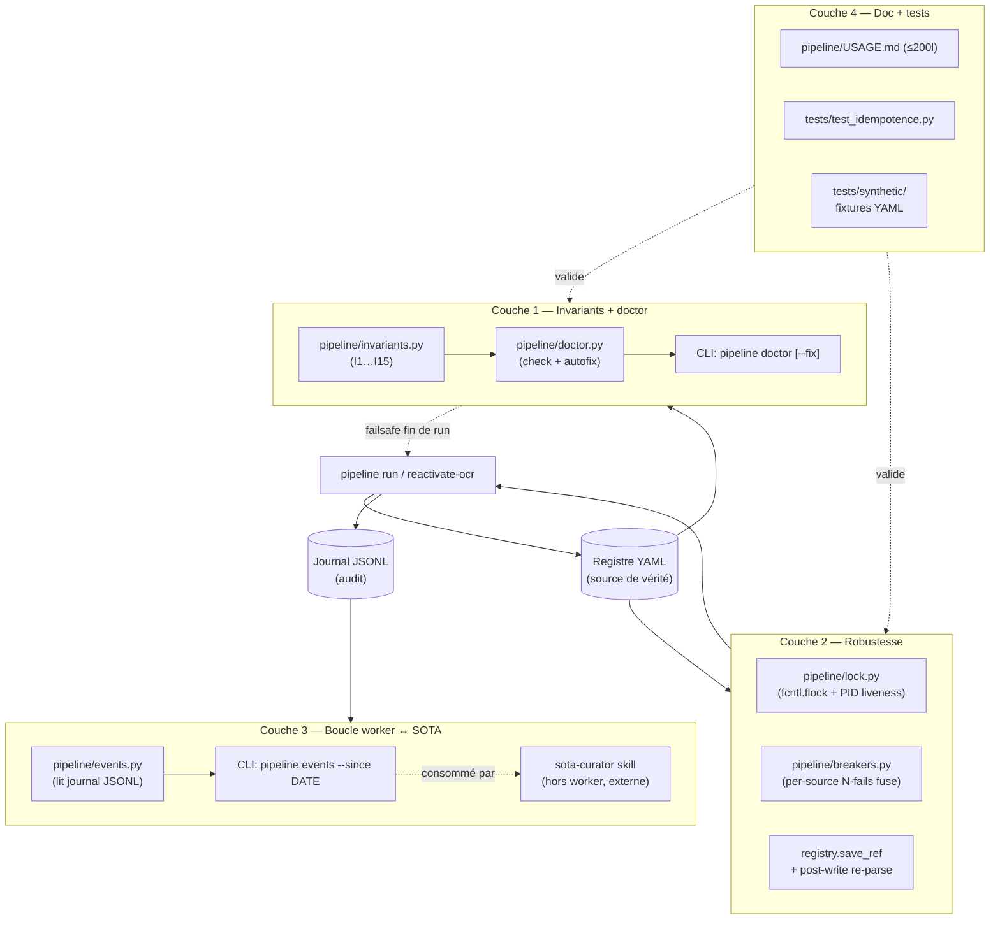

# Worker B — Design d'architecture robuste (plan-design.md)

> **Plan d'action de cette session** : créer le fichier `./plans/plan-design.md`
> dans le repo `references-consolidation` avec exactement le contenu ci-dessous
> (sections 1 à 11). Aucune autre modification de code dans cette session.
> Le design est exécutable en couches indépendantes (cf. §8) ; chaque couche
> sera implémentée dans une session ultérieure dédiée.

---

## Contexte

Le worker B (`pipeline/` dans `references-consolidation`) acquiert et valide
les 909 références bibliographiques du registre `_registry/refs/*.md` via une
FSM 8 états + cascade 10 niveaux. Au 2026-05-24 les fix F1-F4 + P5
sont E2E validés (cf. `coverage_run_2026-05-24.md`).

**Ce qui manque pour que le worker soit "industriel"** :

- Le registre n'a aucun invariant exécutable de bout en bout (le linter R1-R10
  existe mais ne couvre pas la cohérence FSM ↔ champs ↔ filesystem ↔ SOTAs).
  Une drift silencieuse (pdf_path orphelin, cited_in pointant un SOTA inexistant,
  state incohérent avec page1_validation_log) peut passer entre les mailles.
- Aucune protection contre les cas dégénérés : crash en milieu de batch, lancement
  concurrent depuis 2 sessions, source qui retombe en boucle (Sci-Hub down,
  Crossref rate-limit), YAML corrompu par write partiel.
- Pas de boucle de fermeture worker → SOTAs : Arnold 1982 acquis le 2026-05-24
  via F3 reste invisible côté SOTA Bernard Bel qui le cite — l'humain doit
  faire le pont manuellement.
- Pas de doc utilisateur courte (le README explique l'architecture, pas
  l'usage quotidien).

**Objectif du design** : rendre le pipeline *auto-vérifiable*, *résilient aux
erreurs*, et *bouclé* avec les SOTAs qui consomment. Pas de daemon, pas de DB,
pas de queue distribuée — on reste sur le modèle batch CLI + YAML source of truth
+ journal JSONL audit, déjà éprouvé.

**Outcome mesurable** : après chaque session `pipeline run`, l'utilisateur peut
lancer `pipeline doctor` et savoir en < 30 s si le registre est sain, quelles
violations sont auto-réparables et lesquelles nécessitent un arbitrage humain.
Et si un nouveau PDF a été acquis pour une ref citée par un SOTA, il est listé
explicitement pour que le curator l'intègre.

---

## Diagramme — couches et flux



Couches indépendantes : C1 peut être livrée seule (sur-couche du linter R1-R10),
C2 ajoute la robustesse sans toucher la sémantique, C3 expose le journal
existant via une commande, C4 documente et teste.

---

## 1. Invariants exécutables (≥ 12)

Format : `In | Énoncé | Vérification | Action si violé | Auto-réparable ?`

| # | Énoncé formel | Vérification (Python) | Action si violé | Auto-fix |
|---|---|---|---|---|
| I1 | `state` ∈ {candidate, uid_resolved, pdf_acquired, awaiting_rtfm_ocr, needs_reacquisition, page1_validated, sota_cited_confirmed, retracted} ∪ {state.startswith("blocked_human:")} | lecture frontmatter | report ERROR ; aucune auto-action (humain : passer à blocked_human:unknown_state ou corriger) | non |
| I2 | `slug` unique sur l'ensemble du registre (= filename sans .md) | dict[slug] -> [path] ; len > 1 violation | report ERROR ; lister les paths en conflit | non |
| I3 | `uid` ∈ {None} ∪ {préfixes valides : doi:, arxiv:, isbn:, url:, openalex:, bibkey:} | regex match | report ERROR ; ré-attribution manuelle | non |
| I4 | `pdf_path` est relatif depuis 10_SOURCES (pas absolu, ne commence pas par "10_SOURCES/") | `pp.startswith("10_SOURCES/")` ou `pp.startswith("/")` ⇒ violation | report WARN ; **auto-fix R8** déjà existant (`_normalize_pdf_path_inplace`) appliqué via doctor | oui |
| I5 | Si `state` ∈ {pdf_acquired, awaiting_rtfm_ocr, needs_reacquisition, page1_validated, sota_cited_confirmed}, alors `(SOURCES / pdf_path).exists()` | `pdf_abs.exists()` | report ERROR ; bascule auto en `needs_reacquisition` + `doctor_flags += "pdf_missing_on_disk"` | semi |
| I6 | Si `state` ∈ {pdf_acquired, …, sota_cited_confirmed}, alors `pdf_sha256` est set ET 64 hex chars | regex `^[0-9a-f]{64}$` | report ERROR ; recompute sha256 depuis le fichier et update | oui |
| I7 | Si `state` == page1_validated, alors `page1_validation_log.verdict` contient "validated" et page1_validation_log.at est ISO date valide | parse log | report ERROR ; bascule en `needs_reacquisition` | semi |
| I8 | `state_history` strictement monotone en `at` ET dernier élément `state` == frontmatter.state | tri + comparaison | report ERROR ; aucune auto-action (audit humain : peut signaler une concurrence) | non |
| I9 | `acquisition_attempts[].n` strictement monotone 1..N sans trou | comparaison | report WARN ; re-numérotation auto | oui |
| I10 | Si `state.startswith("blocked_human:")` alors `blocked_reason` est non vide ET `blocked_since` est ISO date | `len(blocked_reason) > 0` | report ERROR ; **aucune auto-inférence** (anti-heuristique sur décision humaine) ; liste les refs concernées pour passe manuelle | non |
| I11 | Chaque `cited_in[].name` correspond à un fichier `Publications/SOTA_*.md` ou `Articles/Paper_*.md` existant | `(VAULT / "Articles" / f"{name}.md").exists()` ou variantes | report WARN ; lister les orphelins (typo dans cited_in OU SOTA supprimé) | non |
| I12 | Pour chaque SOTA dans `Publications/`, les refs citées dans le body markdown (regex `\[\[([a-z0-9_]+)\]\]`) ont un fichier `_registry/refs/<slug>.md` ET le slug apparaît dans `cited_in` de ce ref | scan SOTA → ref | report WARN ; lister les ref-citées-non-déclarées (réciprocité brisée) | non |
| I13 | `pdf_sha256` unique sur l'ensemble du registre (pas de doublon de PDF) | dict[sha] -> [slugs] ; len > 1 violation | report WARN ; lister les doublons (peut être légitime : 2 refs pointant le même fichier — l'humain tranche) | non |
| I14 | Aucune transition logée dans `state_history` ne sort d'un TERMINAL_STATE (sota_cited_confirmed, retracted) | scan history pairs | report ERROR ; aucune auto-action (signal de bug worker / mutation hors worker) | non |
| I15 | Si `state` == awaiting_rtfm_ocr depuis > 30 jours ET `last_rtfm_check_at` > 7 jours, flag retard | `now - ocr_pending_since > 30d` AND `now - last_rtfm_check_at > 7d` | report INFO ; suggérer lancement `pipeline reactivate-ocr` | non |

**Note design** : I4 et I6 réutilisent l'existant (`_normalize_pdf_path_inplace`
et `hashlib.sha256` du `cascade._save_and_validate`). I9 est trivial. I11 et I12
sont les plus structurants — ils ferment la boucle registre ↔ SOTAs sans
introduire de couplage actif (juste un check passif).

**Sévérités** :
- ERROR (exit ≠ 0) : I1, I2, I3, I5, I6, I7, I8, I10, I14
- WARN (exit 0 mais rapport) : I4, I9, I11, I12, I13
- INFO : I15

Le linter R1-R10 existant reste appelé inchangé via `linter_wrapper`. Les
invariants I1-I15 sont la **sur-couche worker** (orthogonale au linter
registry).

---

## 2. Architecture `pipeline doctor`

**Module nouveau** : `pipeline/doctor.py` (≈ 250 LOC).

```python
@dataclass
class Violation:
    invariant: str          # "I5"
    ref_slug: str | None    # None pour les invariants registry-level (I2, I12)
    severity: str           # "ERROR" | "WARN" | "INFO"
    message: str
    auto_fixable: bool
    fix_fn: Callable[[Ref], None] | None  # mutation in-place + save_ref
```

**API publique** :
```python
def run_all_checks(refs: Iterable[Ref]) -> list[Violation]: ...
def auto_fix(violations: list[Violation]) -> tuple[int, int]:  # (fixed, skipped)
    # exécute fix_fn pour chaque violation auto_fixable
```

**CLI** :
```
pipeline doctor                  # check only, exit ≠ 0 si ERROR
pipeline doctor --fix            # check + auto-fix les auto_fixable, exit ≠ 0 si ERROR restants
pipeline doctor --severity warn  # n'affiche que WARN+ERROR (skip INFO)
pipeline doctor --json           # sortie machine-readable
```

**Décision d'intégration à `pipeline run`** : oui, en fin de session via
`--no-doctor` (miroir du `--no-lint` existant). Ordre :
1. boucle de transitions
2. `lint_registry.py` (linter R1-R10, déjà là)
3. **`doctor.run_all_checks()`** (invariants I1-I15, nouveau)
4. exit code = max(rc_lint, rc_doctor)

Le `--fix` n'est **pas** invoqué automatiquement en fin de run (anti-surprise) ;
l'utilisateur doit le demander explicitement.

**Format de rapport** (stdout markdown) :
```
# Pipeline doctor — 2026-05-24

## ERROR (3)
- I5 lerdahl_2001_biblio_mir : pdf_path inexistant sur disque
- I10 chemillier_2003_… : blocked_human:title_mismatch sans blocked_reason
- I8 mosses_1982_… : state_history non monotone (at descending entre #3 et #4)

## WARN (12)
- I4 polak_2014_… : pdf_path préfixé "10_SOURCES/" (auto-fixable)
- I11 arnold_1982_… : cited_in:[SOTA_Bernard_Bel_X] introuvable
…

## INFO (4)
- I15 chomsky_1957_… : awaiting_rtfm_ocr depuis 47 jours, last check il y a 12 jours

Récap : 3 ERROR / 12 WARN / 4 INFO  —  8 auto-fixables avec --fix
```

---

## 3. Stratégie pour les cas dégénérés

### 3.1 Circuit-breaker per-source

**Module nouveau** : `pipeline/breakers.py` (≈ 80 LOC).

État en mémoire (pas persisté — réinitialisé chaque session, évite que la
réparation d'une source soit invisible à un nouveau run).

```python
class CircuitBreaker:
    def __init__(self, source: str, fail_threshold: int = 5, window_s: int = 60): ...
    def record(self, success: bool) -> None: ...
    def is_open(self) -> bool: ...  # True = source désactivée
```

Intégration dans `cascade.run_cascade` :
```python
for source, fn in CASCADE:
    if breaker[source].is_open():
        attempts.append({"source": source, "verdict": "skipped_breaker_open",
                         "reason": "5_consecutive_fails_in_60s"})
        continue
    verdict, info = fn(ref)
    breaker[source].record(verdict in ("success", "page1_failed"))
    …
```

Pourquoi pas persister : un breaker persisté désactiverait une source dans la
session suivante sans rien lui dire — l'humain serait surpris. Le coût d'un
fail rapide en début de nouvelle session est négligeable (< 5 s × 10 sources).

### 3.2 Lock fichier sur le registre

**Module nouveau** : `pipeline/lock.py` (≈ 60 LOC).

```python
class WorkerLock:
    """fcntl.flock exclusif sur _registry/_worker.lock + PID + start_at.

    Au démarrage de pipeline run/reactivate-ocr :
      - tente flock LOCK_EX | LOCK_NB
      - si échoue : lit le fichier (PID, start_at) → vérifie si PID alive
        (os.kill(pid, 0)). Si zombie, supprime et retry. Sinon abort propre :
        "another pipeline session running (PID=X, started Y)".
      - écrit (PID, hostname, start_at) dans le fichier
      - à la sortie (context manager) : libère + supprime
    """
```

Appelé dans `cli.cmd_run` et `cli.cmd_reactivate_ocr` (mais PAS dans
`cmd_status`, `cmd_lint`, `cmd_doctor` — read-only).

**Choix d'fcntl** (vs sqlite mutex ou single-process strict) :
- fcntl.flock est OS-natif, libéré automatiquement en cas de crash propre OU
  de SIGKILL (kernel relâche le lock à la mort du process)
- pas de DB à introduire
- compatibilité WSL2 drvfs : fcntl.flock fonctionne sur /mnt/d/ (testé
  historiquement)

### 3.3 Reprise sur crash

**Pas de changement majeur** — le design existant est correct : YAML = source of
vérité, `os.replace` atomique, journal pour audit pas pour reprise.

**Ajout couche 2** : doctor invariant I5 (pdf_path inexistant) attrape les
acquisitions interrompues (PDF moved en milieu de session crashée). Auto-fix
semi : bascule en `needs_reacquisition` + flag → la prochaine `pipeline run`
relance la cascade depuis la source suivante (grâce à `already_tried`).

### 3.4 Post-write validation

**Modification** : `registry.save_ref` enrichi.

```python
def save_ref(ref: Ref) -> None:
    # 1. write atomique via tempfile + os.replace (déjà en place)
    # 2. re-parse le fichier qu'on vient d'écrire :
    rt = parse_frontmatter_md(ref.path.read_text(encoding="utf-8"))
    if rt[0] is None:
        # YAML cassé après écriture — anomalie sévère, restore backup
        raise RegistryWriteCorrupted(ref.path, "post_write_yaml_unparseable")
    # 3. vérifie que les champs critiques sont bien là (state, slug, uid)
    if rt[0].get("state") != ref.frontmatter.get("state"):
        raise RegistryWriteCorrupted(ref.path, "state_field_mismatch_post_write")
```

Backup ? Non — `os.replace` est atomique sur ext4/NTFS/drvfs. Si le re-parse
échoue, c'est un bug du dumper PyYAML, pas un crash filesystem.
`RegistryWriteCorrupted` est levée immédiatement → arrête la session,
investigation humaine.

---

## 4. Boucle worker → SOTAs : design pull via `pipeline events`

### 4.1 Choix : pull (recommandé) vs push vs event-bus

| Approche | Coût | Couplage | Latence | Recommandation |
|---|---|---|---|---|
| Push (worker écrit dans queue, sota-curator consomme) | moyen | fort (qui consomme ?) | faible | non |
| Pull (sota-curator scanne registre/journal on-demand) | faible | nul | acceptable (≤ session) | **oui** |
| Event-bus (Redis/MQ) | élevé | nul mais infrastructure | faible | non (overkill) |

Pull est cohérent avec le reste de l'architecture (batch CLI, pas de daemon).
La latence "≤ session" est acceptable car le workflow réel est : worker tourne
→ utilisateur lance manuellement le sota-curator dans la même session ou la
suivante.

### 4.2 Commande `pipeline events`

**Module nouveau** : `pipeline/events.py` (≈ 100 LOC).

Lit les JSONL de `_registry/_journal/*.jsonl` (déjà écrits par
`journal.append_event`), filtre par date et par état cible.

**CLI** :
```
pipeline events                                  # 24h glissantes
pipeline events --since 2026-05-23               # depuis date
pipeline events --to page1_validated             # filtre cible
pipeline events --cited-in SOTA_Bernard_Bel_X    # refs qui ont bougé ET sont citées par ce SOTA
pipeline events --json                           # machine-readable
```

**Sortie typique** :
```
# Events 2026-05-24 → 2026-05-24 (filter: to=page1_validated, cited-in=SOTA_Bernard_Bel_Temperaments)

2026-05-24T15:32:04Z  arnold_1982_mathematical_model_shruti   uid_resolved → pdf_acquired         via=archive_org
2026-05-24T15:32:11Z  arnold_1982_mathematical_model_shruti   pdf_acquired → page1_validated      via=probe_ok_validate_passed

Refs concernées : 1
SOTAs candidats à mettre à jour : SOTA_Bernard_Bel_Temperaments_Intonation
```

### 4.3 Cas Arnold 1982 — flux complet

1. **Worker** : `pipeline run` → `arnold_1982` passe `candidate` → `uid_resolved`
   (bibkey fallback, F1) → `pdf_acquired` (F3 archive.org) → `page1_validated`
   (probe OK + validation). Journal écrit 3 lignes JSONL.
2. **Utilisateur** : `pipeline events --since 2026-05-24 --to page1_validated
   --cited-in SOTA_Bernard_Bel_Temperaments_Intonation` → liste arnold_1982.
3. **sota-curator skill** (hors worker, dans le repo musicology-phd) : lit la
   liste, ouvre le SOTA, vérifie que la bibliographie cite bien arnold_1982,
   propose à l'utilisateur le passage `page1_validated` → `sota_cited_confirmed`
   pour ce SOTA (= jugement sémantique du claim, hors du domaine worker).
4. **Mutation finale** par le curator (pas par le worker) : update du YAML
   `cited_in:[].verified_at` + state final.

**Aucun couplage** : le worker ignore l'existence des SOTAs, le curator ignore
l'existence du worker — les deux parlent au registre.

### 4.4 Invariant I12 fait le check inverse

I12 (cf. §1) scanne les SOTAs et vérifie la réciprocité : si le SOTA cite
arnold_1982 dans son markdown body mais que `arnold_1982.cited_in` ne contient
pas le nom du SOTA → WARN dans `pipeline doctor`. Garantit qu'aucune citation
SOTA n'est orpheline côté registre.

---

## 5. Doc utilisateur (à écrire dans `pipeline/USAGE.md`, ≤ 200 lignes)

**Squelette validé pour Couche 4** :

```
# USAGE — Worker B au quotidien

## Démarrage de session typique
1. pipeline status                  # combien de refs par état, en 1 coup d'œil
2. pipeline reactivate-ocr          # consomme les OCR finis depuis la dernière session
3. pipeline run                     # pousse les refs actives, lint + doctor en fin
4. pipeline events --since YYYY-MM-DD  # liste les refs qui ont bougé pour le curator

## Filtres utiles
- pipeline run --state uid_resolved --limit 50    # batch cible
- pipeline run --ref arnold_1982 -v               # debug une ref précise
- pipeline run --cited-in SOTA_Bernard_Bel_X      # focus SOTA en cours

## Lecture du récap
[done] X  → transitions réussies
[blocked] Y → bloqué (cf. blocked_reason dans le YAML)
[pending] Z → transition non encore implémentée (rare, NotImplementedYet)
[crash] N → exception non rattrapée (cf. journal pour stack)

## Quand intervenir manuellement
- blocked_human:* → ouvrir le YAML, lire blocked_reason, décider (curator)
- WebSearch queue : _registry/_websearch_queue.md, mode interactif Claude Code
- Playwright manual queue : ~5-10 refs AA-only, à traiter au cas par cas
- pipeline doctor signale I10 (blocked_reason vide) → passe manuelle exigée

## Lever un blocked_by
- éditer YAML : `blocked_by: ""` puis save
- relancer pipeline run --ref <slug>

## doctor : quand --fix ?
- jamais en automatique (anti-surprise)
- après lecture du rapport : pipeline doctor --fix --severity warn
- les ERROR (I5, I10) ne sont jamais auto-fixées : décision humaine requise
```

---

## 6. Stratégie de test de robustesse

### 6.1 Idempotence (sur registry réel)

**Test** : `pipeline/tests/test_idempotence.py`
```
1. pipeline run --limit 0    # full run, capture counts
2. pipeline run --limit 0    # 2ᵉ run immédiat
3. Assert : done(2) == 0 AND blocked(2) ≤ blocked(1) AND crashes(2) == 0
```

Critère : le 2ᵉ run ne doit faire aucune transition (toutes les sources retournent
`skipped_already_tried` ou les états sont terminal/blocked). Si le 2ᵉ run
transitionne, c'est une violation d'idempotence.

### 6.2 Multi-session (concurrence)

**Test** : `pipeline/tests/test_concurrent.py`
```
1. Spawn 2 processes pipeline run en parallèle (subprocess)
2. Assert : exactement 1 finit avec exit 0, l'autre exit ≠ 0 avec "another session running"
3. Aucune corruption YAML (tous les refs touchés re-parseables)
```

### 6.3 Charge

Pas de test de charge synthétique formel. Mais documenter dans USAGE.md le
benchmark observé : ~5-15 refs/min en charge typique (rate-limit AA + IA),
donc `pipeline run --limit 200` ≈ 15-45 min. Si l'utilisateur observe < 5/min
pendant 5 min consécutives, `pipeline doctor` doit signaler les sources en
breaker.

### 6.4 Synthétiques (sans dépendance WAN)

**Fixtures** : `pipeline/tests/synthetic/refs/*.md` (≈ 10 refs fabriquées,
chacune trigge un invariant précis).

**Test** : `pipeline/tests/test_invariants_synthetic.py`
- charge les 10 fixtures
- pour chaque, vérifie que `doctor.run_all_checks()` lève EXACTEMENT la
  violation attendue (par invariant ciblé)
- vérifie que `--fix` répare effectivement les auto-fixables (I4, I6, I9)

Aucun appel réseau, exécutable hors VPN, dans la CI éventuellement.

### 6.5 Régression (toujours)

`assert_coverage.py` reste exécuté en pré-livraison. Étendu Couche 1 pour
ajouter une section I1-I15 (chaque invariant doit avoir au moins une fixture
synthétique qui le déclenche).

---

## 7. Trade-offs explicites

### T1 — Lint failsafe : bloquant / warning / pre-commit

| Option | Avantage | Inconvénient |
|---|---|---|
| Bloquant fin de run (current `--no-lint` override) | l'utilisateur voit immédiatement | peut surprendre si une session longue exit ≠ 0 sur drift mineur |
| Warning seulement | non-disruptif | drift accumulé silencieusement |
| Pre-commit hook côté registry git | très tôt | rate les drifts qui n'arrivent jamais dans git |

**Recommandation** : **bloquant fin de run** (= current) + **ajouter** pre-commit
hook côté registry git (`/mnt/d/.../_registry/.git/hooks/pre-commit`) qui lance
`pipeline doctor --severity error` avant commit. Hors-scope worker (le hook est
dans le repo registre), mais à documenter dans USAGE.md.

### T2 — Boucle worker → SOTA

Déjà discuté §4.1. **Recommandation : pull via `pipeline events`**. Couplage
nul, exploite le journal JSONL existant, latence acceptable.

### T3 — Concurrence

| Option | Avantage | Inconvénient |
|---|---|---|
| fcntl.flock + PID liveness | OS-natif, libéré sur crash, WSL2 OK | un peu de code (≈ 60 LOC) |
| SQLite mutex | DB déjà éprouvé | introduit une DB pour 1 lock — overkill |
| Single-process strict (pgrep) | trivial | races sur lecture pgrep, faux positifs WSL2 |

**Recommandation : fcntl.flock + PID liveness check**. Standard sur Linux,
compatible WSL2 drvfs, code minimal.

### T4 — Snapshot avant batch

| Option | Avantage | Inconvénient |
|---|---|---|
| tar full du registre | rollback simple | ~3 MB × N runs, polluant, hors git |
| Copies des refs touchées | granulaire | tracking de "touchées" fragile |
| Rien — s'appuyer sur git | natif, déjà là | requiert discipline `git add -p` avant run |

**Recommandation : rien** — le registre est git-versioned dans
`/mnt/d/.../10_SOURCES/_registry/.git/`. Documenter dans USAGE.md : "avant un
batch important, `cd _registry && git status` + commit si dirty". Worker
n'introduit pas de snapshot automatique.

---

## 8. Plan d'exécution en couches (90 min/couche timer)

Chaque couche est **indépendamment livrable** (la 1 sans la 2, la 3 sans la 1, etc.).
Critère d'acceptance explicite par couche.

### Couche 1 — Invariants + doctor (3-4 sessions)

**Livrables** :
- `pipeline/invariants.py` (≈ 350 LOC) — fonctions `check_I1(ref)` … `check_I15(ref|registry)`
- `pipeline/doctor.py` (≈ 250 LOC) — orchestrateur + `Violation` + `auto_fix`
- `pipeline/cli.py` enrichi : sous-commande `doctor [--fix] [--severity X] [--json]`
- Intégration dans `cmd_run` : appel doctor en fin de run (`--no-doctor` flag)
- `pipeline/tests/synthetic/` (≈ 10 fixtures + `test_invariants_synthetic.py`)
- `assert_coverage.py` étendu : vérifie qu'I1-I15 ont chacun ≥ 1 fixture
- Mise à jour `README.md` (commandes)

**Critère d'acceptance** :
- `pipeline doctor` sur registre réel exit 0 OU produit un rapport listant les
  violations vraies (à valider manuellement)
- `pipeline doctor` sur 10 fixtures synthétiques : 10/10 violations attendues
  détectées, 0 faux positifs
- `pipeline doctor --fix` sur fixtures auto-fixables : 100% réparées

**Timer** : 90 min par session de codage. Si une session dépasse :
- I1-I7 simples (registre-level checks) : 1 session ≈ 90 min
- I8-I12 logique + filesystem (cross-files SOTAs) : 1 session ≈ 90 min
- doctor.py + CLI + intégration `pipeline run` : 1 session ≈ 90 min
- fixtures + tests + assert_coverage : 1 session ≈ 60 min

### Couche 2 — Gestion d'erreurs + idempotence (2-3 sessions)

**Livrables** :
- `pipeline/lock.py` (≈ 60 LOC) — `WorkerLock` context manager
- `pipeline/breakers.py` (≈ 80 LOC) — `CircuitBreaker` per-source en mémoire
- `cascade.run_cascade` enrichi : check breaker per source
- `registry.save_ref` enrichi : post-write re-parse + `RegistryWriteCorrupted`
- `cli.cmd_run` et `cmd_reactivate_ocr` : wrapping dans `with WorkerLock()`
- `pipeline/tests/test_idempotence.py` + `test_concurrent.py`

**Critère d'acceptance** :
- 2 `pipeline run` consécutifs : 2ᵉ a 0 transitions effectuées
- 2 `pipeline run` en parallèle : 1 exit 0, 1 exit ≠ 0 propre
- Simulation Sci-Hub 5 fails consécutifs : 6ᵉ ref skip via `breaker_open`
- Test post-write corruption (mock YAML dumper qui produit truncated) : lève
  `RegistryWriteCorrupted`

**Timer** : 90 min × 2-3 sessions :
- lock.py + intégration : 1 session
- breakers.py + intégration cascade : 1 session
- post-write validation + tests : 1 session

### Couche 3 — Boucle worker ↔ SOTA (2 sessions)

**Livrables** :
- `pipeline/events.py` (≈ 100 LOC) — lecture JSONL + filtres
- `cli.py` : sous-commande `events [--since] [--to] [--cited-in] [--json]`
- Doc d'intégration pour sota-curator skill (markdown, dans
  `~/.claude/plugins/sota-curator/USAGE.md` côté projet musicology-phd — hors
  ce repo)
- Test `pipeline/tests/test_events.py` — fixtures de journal JSONL

**Critère d'acceptance** :
- `pipeline events --since 2026-05-24 --to page1_validated` retourne la liste
  attendue sur journal de test
- Filtres combinables : `--cited-in X --to page1_validated` = intersection
  correcte
- `--json` parseable par `json.loads()`

**Timer** : 90 min × 2 sessions :
- events.py + filtres + CLI : 1 session
- tests + intégration doc sota-curator : 1 session

### Couche 4 — Doc + tests robustesse (1 session)

**Livrables** :
- `pipeline/USAGE.md` (≤ 200 lignes, squelette §5)
- `README.md` mis à jour (pointers vers USAGE.md)
- `pipeline/tests/test_idempotence.py` + `test_concurrent.py` (overlap C2 :
  les écrire en C2 si elles bloquent l'acceptance, sinon les laisser pour C4)
- Vérification finale : `assert_coverage.py` étendu à I1-I15 passe

**Critère d'acceptance** :
- USAGE.md couvre les 5 commandes status/run/lint/reactivate-ocr/doctor/events
- Suite tests : `python -m pytest pipeline/tests/` exit 0 (si pytest, sinon
  scripts individuels)

**Timer** : 60-90 min × 1 session.

---

## 9. Décisions explicites sur les trous 1-10

| # | Trou | Décision |
|---|---|---|
| 1 | Pas d'invariants formels exécutables | **Couche 1** |
| 2 | Pas de gestion cas dégénérés (crash, write conflict, réseau, PDF disparu) | **Couche 2** (sauf "PDF disparu" → détecté par I5 en Couche 1) |
| 3 | Pas de boucle worker → SOTAs notifiés | **Couche 3** (pull via `pipeline events`) |
| 4 | Pas de doc utilisateur | **Couche 4** (`pipeline/USAGE.md`) |
| 5 | Pas de test de robustesse (idempotence, multi-session, charge) | **Couche 2 + 4** (idempotence + concurrent en C2 critères, doc charge en C4) |
| 6 | AA Playwright Turnstile désactivé V1 (mismatch versions) | **Hors scope design** — fix isolé séparé. ROI faible (5-10 refs concernées, queue manuelle gère). À reconsidérer si la queue dépasse 30 refs. |
| 7 | ~23 refs en `blocked_human` sans `blocked_reason` documenté | **Hors scope design** — passe manuelle humaine séparée. **Invariant I10** (Couche 1) détecte le problème et liste les refs, mais ne le résout PAS automatiquement (anti-heuristique sur décision humaine). |
| 8 | Helper plugin `AnnasArchive.search_books` cassé (sélecteur CSS dépassé) | **Hors scope design** — bypass actuel dans worker fonctionne (`_aa_md5_from_title` via regex split). Fix isolé séparé, à attaquer si on a besoin de `search_books` ailleurs (sota-writer, autres workers). |
| 9 | Tâches projet #104 (P9α décisions), #106 (OA bot-gated), #117 (publis L13-L17) | **Hors scope design** — tracking projet via task-tracker, indépendant du worker. |
| 10 | Étape 9 final cleanup (scratch/, /tmp/) | **Hors scope design** — cosmétique, à intégrer dans un script séparé (potentiellement un hook SessionEnd dans le repo musicology-phd, pas dans le worker). |

**Récap** : trous 1-5 dans le design (Couches 1-4), trous 6-10 explicitement
hors scope avec justification.

---

## 10. Garde-fous méta

- **Timer 90 min/couche de session** (vrai chronomètre). Si dépassement,
  documenter le hors-scope dans une note `pipeline/tests/coverage_run_*.md`
  plutôt qu'étirer.
- **Pas de "livré" sans tableau testé E2E / code écrit non testé** (continuité
  de la discipline `assert_coverage.py` existante, étendue à I1-I15).
- **Pas d'auto-inférence sur décisions humaines** : I10 détecte mais ne fixe
  pas ; `blocked_reason` doit avoir été posé par l'humain. Même règle pour
  toute heuristique future qui toucherait à un champ "décision".
- **Honnêteté partial-vs-tested** : chaque livrable couche signale
  explicitement les branches non couvertes par fixtures synthétiques (style
  `coverage_run_2026-05-24.md` P5 : "ocr_failed non testé sur ref réelle —
  vérifié par lecture code").
- **Réutilisation maximale des helpers existants** :
  - `_normalize_pdf_path_inplace` pour I4 auto-fix (déjà en place,
    `transitions.py:22-58`)
  - `validate_pdf_against_ref`, `probe_pdf_health` pour I5/I7 (déjà importés)
  - `rtfm_status_for_ref` pour I15 (déjà en place, `rtfm_helper.py`)
  - `hashlib.sha256` pour I6 (déjà utilisé `cascade._save_and_validate`)
  - `archive_org_helper`, `oa_finder`, `s2_resolver`, `annas_archive` —
    inchangés
  - `lint_registry.py` (R1-R10) — inchangé, appelé via `linter_wrapper`
- **Si un trou est mieux résolu hors worker, le dire** : trou 10 (cleanup),
  trou 7 (passe humaine), trou 6 (sous-projet Playwright). Cette liste est
  finale pour le design, pas un wishlist.

---

## 11. Vérification end-to-end du design (par couche)

Après chaque couche, l'utilisateur peut vérifier :

**Couche 1** :
```bash
python -m pipeline doctor               # exit 0 ou rapport
python -m pipeline doctor --json | jq   # parseable
python pipeline/tests/test_invariants_synthetic.py  # 10/10 fixtures OK
python pipeline/tests/assert_coverage.py            # I1-I15 ont leur tableau
```

**Couche 2** :
```bash
python -m pipeline run && python -m pipeline run   # 2ᵉ : 0 done
python -m pipeline run &  python -m pipeline run   # 1 exit 0, 1 exit ≠ 0
python pipeline/tests/test_idempotence.py
python pipeline/tests/test_concurrent.py
```

**Couche 3** :
```bash
python -m pipeline events --since 2026-05-24
python -m pipeline events --to page1_validated --json | jq
# (côté musicology-phd) sota-curator consomme la liste
```

**Couche 4** :
```bash
cat pipeline/USAGE.md   # ≤ 200 lignes, 5 commandes couvertes
python pipeline/tests/test_idempotence.py
python pipeline/tests/assert_coverage.py
```

**Vérification de non-régression** (toujours, à chaque couche) :
```bash
python pipeline/tests/test_f1_negative.py   # anti-homonymie F1 OK
python pipeline/tests/assert_coverage.py     # F1-F4 + P5 tableaux toujours OK
python -m pipeline status                    # 909 refs parsées sans crash
python -m pipeline lint                      # R1-R10 sortent exit 0 ou rapport
```

---

## Fichier final

Une fois ce plan approuvé, j'écris ce contenu **intégralement** dans
`./plans/plan-design.md` du repo `references-consolidation`. Aucune autre
modification (pas de code, pas de tests) — l'implémentation se fera en
sessions dédiées par couche, chacune avec son propre plan focalisé.
